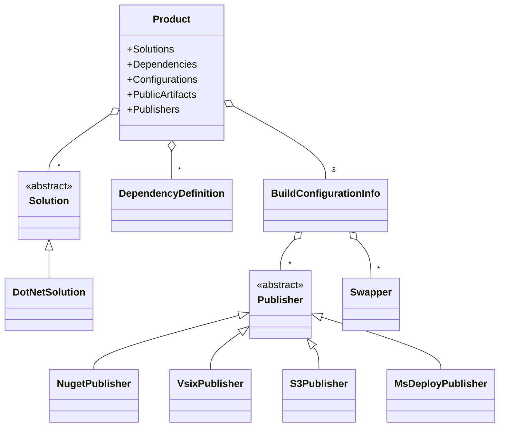

# PostSharp.Engineering

Build orchestration SDK for PostSharp and Metalama repositories.

## Overview

PostSharp.Engineering is an internal build orchestration framework designed for complex multi-repository .NET projects. It provides:

- **Unified build workflow** via `Build.ps1` front-end script
- **Dependency management** across repositories (local, feed, and build server sources)
- **CI/CD integration** with TeamCity project and build configuration generation
- **Multi-target publishing** to NuGet feeds, VSIX marketplace, AWS S3, IIS, and more
- **Version management** with automatic bumping and tagging
- **Docker support** for containerized builds

While released under an open-source license (as a dependency of Metalama), this SDK is an ad-hoc solution for PostSharp/Metalama projects, not a general-purpose build framework.

## Packages

This repository produces three NuGet packages:

| Package | Purpose |
|---------|---------|
| **PostSharp.Engineering.BuildTools** | Core build SDK, added as a PackageReference from the `eng/src` build project |
| **PostSharp.Engineering.Sdk** | MSBuild SDK with `.props` and `.targets` files for project configuration |
| **PostSharp.Engineering.DocFx** | DocFx documentation generation extensions |

Both `BuildTools` and `Sdk` packages must be used together with matching versions.

## Versioning

Version management is centralized in the `eng/` directory. All solutions and projects in a product share the same version.

### Version Files

| File | Purpose |
|------|---------|
| `eng/MainVersion.props` | Defines the product version (required) |
| `eng/Versions.props` | Defines dependency versions and imports MainVersion.props |
| `eng/Versions.g.props` | Auto-generated overrides for local/build-server dependencies |
| `eng/Dependencies.props` | Manual dependency source overrides |

### MainVersion.props Properties

| Property | Description | Example |
|----------|-------------|---------|
| `MainVersion` | The main version number (3 components: major.minor.patch) | `2023.2.279` |
| `PackageVersionSuffix` | Version suffix for pre-release packages (empty for RTM) | `-preview`, `-rc` |
| `OverriddenPatchVersion` | Optional 4-component version for patch releases | `2023.2.279.1` |
| `OurPatchVersion` | Patch counter when using `OverriddenPatchVersion` | `1` |

### Version Computation

The final package version is computed as:
- **Standard**: `{MainVersion}{PackageVersionSuffix}` (e.g., `2023.2.279-preview`)
- **RTM**: `{MainVersion}` with empty suffix (e.g., `2023.2.279`)
- **Patch**: `{OverriddenPatchVersion}{PackageVersionSuffix}` (e.g., `2023.2.279.1`)

### Patch Versions

The `OverriddenPatchVersion` property enables releasing patches of repo B without releasing a new build of dependent repo A:

```xml
<Project>
    <PropertyGroup>
        <MainVersion>2023.2.279</MainVersion>
        <PackageVersionSuffix></PackageVersionSuffix>
        <OverriddenPatchVersion>2023.2.279.1</OverriddenPatchVersion>
        <OurPatchVersion>1</OurPatchVersion>
    </PropertyGroup>
</Project>
```

The `OverriddenPatchVersion` must start with the `MainVersion` value.

### Versions.props Structure

```xml
<Project>
    <!-- Import the main version -->
    <Import Project="MainVersion.props" />

    <!-- Define product version properties -->
    <PropertyGroup>
        <MyProductVersion>$(MainVersion)$(PackageVersionSuffix)</MyProductVersion>
        <MyProductAssemblyVersion>$(MainVersion)</MyProductAssemblyVersion>
    </PropertyGroup>

    <!-- Dependency versions -->
    <PropertyGroup>
        <SomeDependencyVersion>1.2.3</SomeDependencyVersion>
    </PropertyGroup>

    <!-- Import auto-generated overrides (for local/build-server dependencies) -->
    <Import Project="Versions.g.props" Condition="Exists('Versions.g.props')" />

    <!-- Import manual overrides -->
    <Import Project="Dependencies.props" Condition="Exists('Dependencies.props')" />

    <!-- Set MSBuild version properties -->
    <PropertyGroup>
        <AssemblyVersion>$(MyProductAssemblyVersion)</AssemblyVersion>
        <Version>$(MyProductVersion)</Version>
    </PropertyGroup>
</Project>
```

### AutoUpdatedVersions.props

The `eng/AutoUpdatedVersions.props` file tracks released versions of dependencies and the current product. It is automatically updated during publishing and version bumping.

```xml
<Project>
    <PropertyGroup>
        <!-- Released versions of dependencies (auto-updated from their repos) -->
        <MetalamaCompilerVersion>2026.0.1</MetalamaCompilerVersion>
        <MetalamaVersion>2026.0.15</MetalamaVersion>

        <!-- This product's released version (updated after publishing) -->
        <MyProductReleaseVersion>2026.0.5</MyProductReleaseVersion>
        <MyProductReleaseMainVersion>2026.0.5</MyProductReleaseMainVersion>
    </PropertyGroup>
</Project>
```

This file serves two purposes:
1. **Dependency tracking**: Stores the released versions of dependencies with `AutoUpdateVersion = true`
2. **Release tracking**: Records this product's last released version (`{ProductName}ReleaseVersion` and `{ProductName}ReleaseMainVersion`)

### AutoUpdateVersion Property

The `DependencyDefinition.AutoUpdateVersion` property (default: `true`) controls whether a dependency's version is automatically updated in `AutoUpdatedVersions.props` during bumping:

```csharp
public static DependencyDefinition PostSharpEngineering { get; } = new(...)
{
    // Set to false for dependencies that should not trigger auto-updates
    AutoUpdateVersion = false
};
```

Dependencies with `AutoUpdateVersion = false` (like `PostSharp.Engineering` itself) are excluded from automatic version propagation.

### MainVersionDependency

Products can inherit their version from a parent dependency using `MainVersionDependency`:

```csharp
var product = new Product(...)
{
    // This product's version comes from Metalama's version
    MainVersionDependency = MetalamaDependencies.V2026_0.Metalama
};
```

When set, the product doesn't maintain its own `MainVersion` but inherits from the specified dependency's released version.

### Version Bumping

The `bump` command increments the product version after a successful deployment:

```powershell
Build.ps1 bump              # Bump version (only on development branch)
Build.ps1 bump --force      # Bump even on non-development branches
Build.ps1 bump --override   # Ignore previous bump commits
```

**Bump workflow:**
1. Verifies we're on the development branch
2. Checks for pending changes from the release branch
3. Reads `AutoUpdatedVersions.props` from all dependencies with `AutoUpdateVersion = true`
4. If there are changes since last deployment:
   - For products with their own version: increments `MainVersion` patch number (e.g., `2023.2.279` → `2023.2.280`)
   - For products with `MainVersionDependency`: uses the inherited version
5. Updates `AutoUpdatedVersions.props` with new dependency versions and this product's new version
6. Commits and pushes the changes (on CI)

**Bump strategies** (see [`IBumpStrategy`](src/PostSharp.Engineering.BuildTools/Build/Bumping/IBumpStrategy.cs)):
- `DefaultBumpStrategy`: Increments the patch component of `MainVersion`
- `PatchVersionBumpStrategy`: Increments `OurPatchVersion` for 4-component versioning

For implementation details, see:
- [`MainVersionFile.cs`](src/PostSharp.Engineering.BuildTools/Build/Files/MainVersionFile.cs) - MainVersion.props parsing
- [`AutoUpdatedVersionsFile.cs`](src/PostSharp.Engineering.BuildTools/Build/Files/AutoUpdatedVersionsFile.cs) - AutoUpdatedVersions.props management
- [`BumpCommand.cs`](src/PostSharp.Engineering.BuildTools/Build/Bumping/BumpCommand.cs) - Bump workflow
- [`VersionComponents.cs`](src/PostSharp.Engineering.BuildTools/Build/Model/VersionComponents.cs) - Version computation

## Quick Start

For new projects, use the template repository: https://github.com/postsharp-ops/PostSharp.Engineering.ProductTemplate

### Build Commands

```powershell
# Show help
Build.ps1 --help

# Prepare dependencies (generates version files)
Build.ps1 prepare

# Build all packages
Build.ps1 build

# Build and run tests
Build.ps1 test

# Publish artifacts
Build.ps1 publish
```

### Dependency Management

```powershell
# List dependencies
Build.ps1 dependencies list

# Use local clone of a dependency
Build.ps1 dependencies set local <DEPENDENCY>

# Reset to default (feed/build server)
Build.ps1 dependencies reset --all

# Fetch latest from build server
Build.ps1 dependencies fetch

# Update to newest version
Build.ps1 dependencies update
```

## Command Reference

### Core Commands

| Command | Description |
|---------|-------------|
| `prepare` | Creates files required to build (version props, NuGet config) |
| `build` | Builds all packages (implies `prepare`) |
| `test` | Builds and runs all tests (implies `build`) |
| `publish` | Publishes built artifacts to configured destinations |
| `prepublish` | Prepares for publishing (validation, checks) |
| `postpublish` | Finalizes publishing (version bump, tagging) |
| `swap` | Swaps deployment slots (blue/green deployment) |
| `bump` | Bumps the product version |
| `verify` | Verifies public artifact dependencies are published |
| `clean` | Cleans build artifacts |

### Dependency Commands

| Command | Description |
|---------|-------------|
| `dependencies list` | Lists product dependencies |
| `dependencies set` | Sets dependency source (local, feed, build server) |
| `dependencies reset` | Resets to default configuration |
| `dependencies fetch` | Fetches from build server |
| `dependencies update` | Updates to newest available version |
| `dependencies update-eng` | Updates PostSharp.Engineering version |

### Code Style Commands

| Command | Description |
|---------|-------------|
| `codestyle format` | Formats code using ReSharper |
| `codestyle inspect` | Inspects code for warnings |
| `codestyle push` | Pushes code style changes to engineering repo |
| `codestyle pull` | Pulls code style from engineering repo |

### TeamCity Commands

| Command | Description |
|---------|-------------|
| `teamcity run` | Triggers a TeamCity build |
| `teamcity project get` | Gets TeamCity project details |
| `teamcity project create` | Creates a new TeamCity project |
| `teamcity project create-this` | Creates project for current repo |

### Tool Commands

| Command | Description |
|---------|-------------|
| `tools kill` | Kills compiler processes (useful after failed builds) |
| `tools dump` | Dumps process information |
| `tools git merge-downstream` | Merges to downstream branch |
| `tools git check-upstream` | Checks upstream for unmerged changes |
| `tools nuget rename` | Renames packages in a directory |
| `tools nuget verify-public` | Verifies packages reference only public packages |
| `generate-scripts` | Generates CI and Docker scripts |

## MSBuild SDK Files

The `PostSharp.Engineering.Sdk` package provides:

### Props Files

| File | Purpose |
|------|---------|
| `BuildOptions.props` | Compiler settings (language version, nullability, output paths) |
| `SourceLink.props` | SourceLink configuration for debugging |
| `Coverage.props` | Code coverage with Coverlet (test projects only) |
| `StrongName.props` | Strong name signing configuration |
| `MetalamaBranding.props` | Metalama NuGet package branding |
| `PostSharpBranding.props` | PostSharp NuGet package branding |
| `SystemTypes.props` | Modern C# features for older target frameworks |

### Targets Files

| File | Purpose |
|------|---------|
| `AssemblyMetadata.targets` | Adds package versions to assembly metadata |
| `TeamCity.targets` | Build and test reporting for TeamCity |
| `AspNetPublish.targets` | ASP.NET Core project publishing |
| `WebPublish.targets` | Web project artifact publishing |
| `TestsPublish.targets` | Test project artifact publishing |
| `PackagesConfig.targets` | Legacy packages.config support |
| `CleanXmlDoc.targets` | XML documentation cleanup |

## Installation

### Step 1. Edit global.json

```json
{
  "sdk": {
    "version": "9.0.100",
    "rollForward": "latestPatch"
  },
  "msbuild-sdks": {
    "PostSharp.Engineering.Sdk": "2023.2.1"
  }
}
```

### Step 2. Create eng/Packaging.props

```xml
<Project>
    <PropertyGroup>
        <Authors>Your Company</Authors>
        <PackageProjectUrl>https://github.com/your/repo</PackageProjectUrl>
        <PackageTags>your tags</PackageTags>
        <PackageRequireLicenseAcceptance>true</PackageRequireLicenseAcceptance>
        <PackageIcon>Icon.png</PackageIcon>
        <PackageLicenseFile>LICENSE.md</PackageLicenseFile>
    </PropertyGroup>

    <ItemGroup>
        <None Include="$(MSBuildThisFileDirectory)..\Icon.png" Visible="false" Pack="true" PackagePath="" />
        <None Include="$(MSBuildThisFileDirectory)..\LICENSE.md" Visible="false" Pack="true" PackagePath="" />
    </ItemGroup>
</Project>
```

### Step 3. Create eng/MainVersion.props

```xml
<Project>
    <PropertyGroup>
        <MainVersion>1.0.0</MainVersion>
        <PackageVersionSuffix>-preview</PackageVersionSuffix>
    </PropertyGroup>
</Project>
```

### Step 4. Create eng/Versions.props

```xml
<Project>
    <Import Project="MainVersion.props" />

    <PropertyGroup>
        <MyProductVersion>$(MainVersion)$(PackageVersionSuffix)</MyProductVersion>
        <MyProductAssemblyVersion>$(MainVersion)</MyProductAssemblyVersion>
    </PropertyGroup>

    <!-- Dependency versions -->
    <PropertyGroup>
        <SomeDependencyVersion>1.2.3</SomeDependencyVersion>
    </PropertyGroup>

    <!-- Local overrides -->
    <Import Project="Dependencies.props" Condition="Exists('Dependencies.props')" />

    <PropertyGroup>
        <AssemblyVersion>$(MyProductAssemblyVersion)</AssemblyVersion>
        <Version>$(MyProductVersion)</Version>
    </PropertyGroup>
</Project>
```

### Step 5. Create Directory.Build.props

```xml
<Project>
  <PropertyGroup>
    <RepoDirectory>$(MSBuildThisFileDirectory)</RepoDirectory>
    <RepoKind>GitHub</RepoKind>
  </PropertyGroup>

  <Import Project="eng\Versions.props" />
  <Import Project="eng\Packaging.props" />

  <Import Sdk="PostSharp.Engineering.Sdk" Project="BuildOptions.props" />
  <Import Sdk="PostSharp.Engineering.Sdk" Project="SourceLink.props" />
</Project>
```

### Step 6. Create Directory.Build.targets

```xml
<Project>
  <Import Sdk="PostSharp.Engineering.Sdk" Project="AssemblyMetadata.targets" />
  <Import Sdk="PostSharp.Engineering.Sdk" Project="TeamCity.targets" />
</Project>
```

### Step 7. Create the build project (eng/src/Build.csproj)

```xml
<Project Sdk="Microsoft.NET.Sdk">
    <PropertyGroup>
        <OutputType>Exe</OutputType>
        <TargetFramework>net10.0</TargetFramework>
        <AssemblyName>Build</AssemblyName>
        <LangVersion>latest</LangVersion>
        <Nullable>enable</Nullable>
    </PropertyGroup>

    <ItemGroup>
        <PackageReference Include="PostSharp.Engineering.BuildTools" Version="$(PostSharpEngineeringVersion)" />
    </ItemGroup>
</Project>
```

### Step 8. Create eng/src/Program.cs

```csharp
using PostSharp.Engineering.BuildTools;
using PostSharp.Engineering.BuildTools.Build.Model;
using PostSharp.Engineering.BuildTools.Build.Solutions;

var product = new Product(/* your dependency definition */)
{
    Solutions =
    [
        new DotNetSolution("YourProduct.sln") { SupportsTestCoverage = true }
    ],
    PublicArtifacts = Pattern.Create(
        "YourPackage.$(PackageVersion).nupkg")
};

var app = new EngineeringApp(product);
return app.Run(args);
```

### Step 9. Create Build.ps1

```powershell
if ($env:VisualStudioVersion -eq $null) {
    Import-Module "C:\Program Files\Microsoft Visual Studio\2022\Enterprise\Common7\Tools\Microsoft.VisualStudio.DevShell.dll"
    Enter-VsDevShell -VsInstallPath "C:\Program Files\Microsoft Visual Studio\2022\Enterprise\" -StartInPath $(Get-Location)
}

& dotnet run --project "$PSScriptRoot\eng\src\Build.csproj" -- $args
exit $LASTEXITCODE
```

### Step 10. Update .gitignore

```
artifacts/
eng/tools/
*.g.props
```

## Architecture



### Key Concepts

- **Product**: Root configuration representing a repository
- **Solution**: A buildable unit (solution, project, or script)
- **BuildConfigurationInfo**: Configuration-specific settings (Debug, Release, Public)
- **DependencyDefinition**: Reference to another repository/product
- **Publisher**: Deploys artifacts to feeds, marketplaces, or servers
- **Swapper**: Blue/green deployment slot swapping

## Continuous Integration

We use TeamCity with Kotlin DSL configuration stored in `.teamcity/`.

### Build Configurations

```powershell
# Debug build
Build.ps1 test --numbered %build.number%

# Release build (signed)
Build.ps1 test --configuration Release --sign

# Publish to internal feeds
Build.ps1 publish

# Publish to public feeds
Build.ps1 publish --public
```

### Artifacts

All artifacts are published to `artifacts/publish/`. TeamCity configurations should export and import these paths.

### Required Environment Variables

Common environment variables (see [`EnvironmentVariableNames.cs`](src/PostSharp.Engineering.BuildTools/EnvironmentVariableNames.cs) for the complete list):

| Variable | Purpose |
|----------|---------|
| `SIGNSERVER_SECRET` | Code signing server authentication |
| `NUGET_ORG_API_KEY` | nuget.org API key |
| `GITHUB_TOKEN` | GitHub API access |
| `TEAMCITY_CLOUD_TOKEN` | TeamCity API access |
| `AWS_ACCESS_KEY_ID` | AWS S3 publishing |
| `AWS_SECRET_ACCESS_KEY` | AWS S3 publishing |
| `VS_MARKETPLACE_ACCESS_TOKEN` | VSIX publishing |
| `AZURE_DEVOPS_TOKEN` | Azure DevOps integration |
| `TYPESENSE_API_KEY` | Search indexing |


## Documentation

Additional design documentation is available in the [doc/](doc/) folder:

- [Vision](doc/vision.md) - Project goals
- [Use Cases](doc/use-cases.md) - Supported scenarios
- [Build Flow](doc/build-flow.md) - Build process diagrams
- [Publish Flow](doc/publish-flow.md) - Publishing process
- [Dependencies](doc/dependencies.md) - Metalama dependency graph
- [DockerBuild.ps1](doc/dockerbuild.md) - Containerized builds and Claude sandboxing

## License

This project is licensed under the MIT License. See [LICENSE.md](LICENSE.md) for details.
