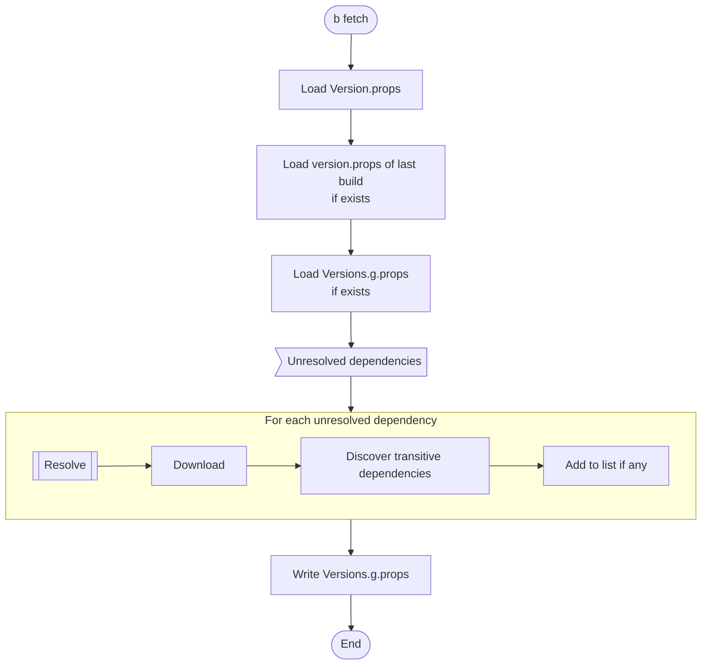
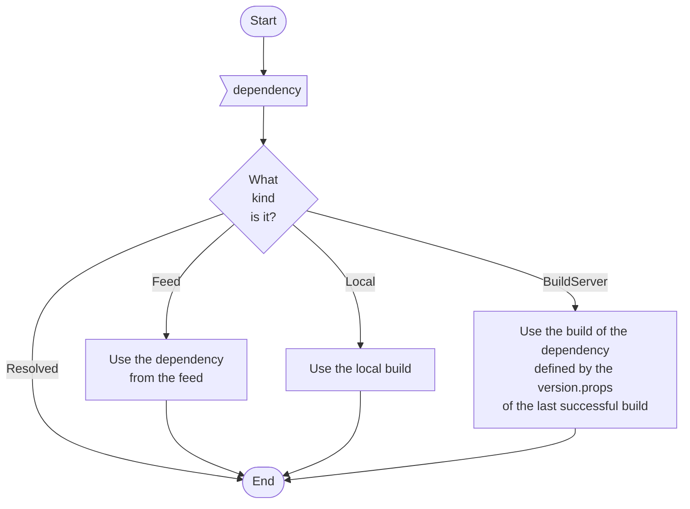

# Build flow

```mermaid
flowchart TB
    start([b prepare])

    start --> are_dependencies_resolved{Are<br>dependencies<br>resolved?}

    are_dependencies_resolved --> |Yes| END
    are_dependencies_resolved --> fetch[b fetch] --> END

    END([End])
```

```mermaid
flowchart TB
    start([b fetch])

    start --> load_default_version[Load Version.props]

    load_default_version --> load_last_build[Load version.props of last build<br>if exists]
    load_last_build --> load_versions_override_file[Load Versions.g.props<br>if exists]
    load_versions_override_file --> dependency_list>Unresolved dependencies]

    dependency_list --> for_each_dependency
    
    subgraph for_each_dependency[For each unresolved dependency]
        resolve[[Resolve]] --> download[Download] --> discover[Discover transitive dependencies] --> add[Add to list if any]
    end

    for_each_dependency --> write_versions_override_file[Write Versions.g.props] --> END([End])
```

## Dependencies resolution

```mermaid
flowchart TB

        start([Start])

        start --> dependency>dependency]

        dependency --> switch_dependency_kind{What<br>kind<br>is it?}

        switch_dependency_kind --> |Resolved| END
        switch_dependency_kind --> |Feed| use_feed[Use the dependency<br>from the feed]
        switch_dependency_kind --> |Local| use_local[Use the local build]
        switch_dependency_kind --> |BuildServer| use_proven_dependency[Use the build of the dependency<br>defined by the version.props<br>of the last successful build]

        END([End])

        use_feed --> END
        use_local --> END
        use_proven_dependency --> END

```