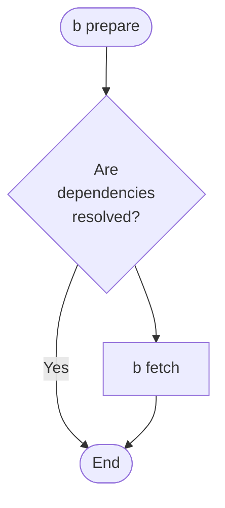
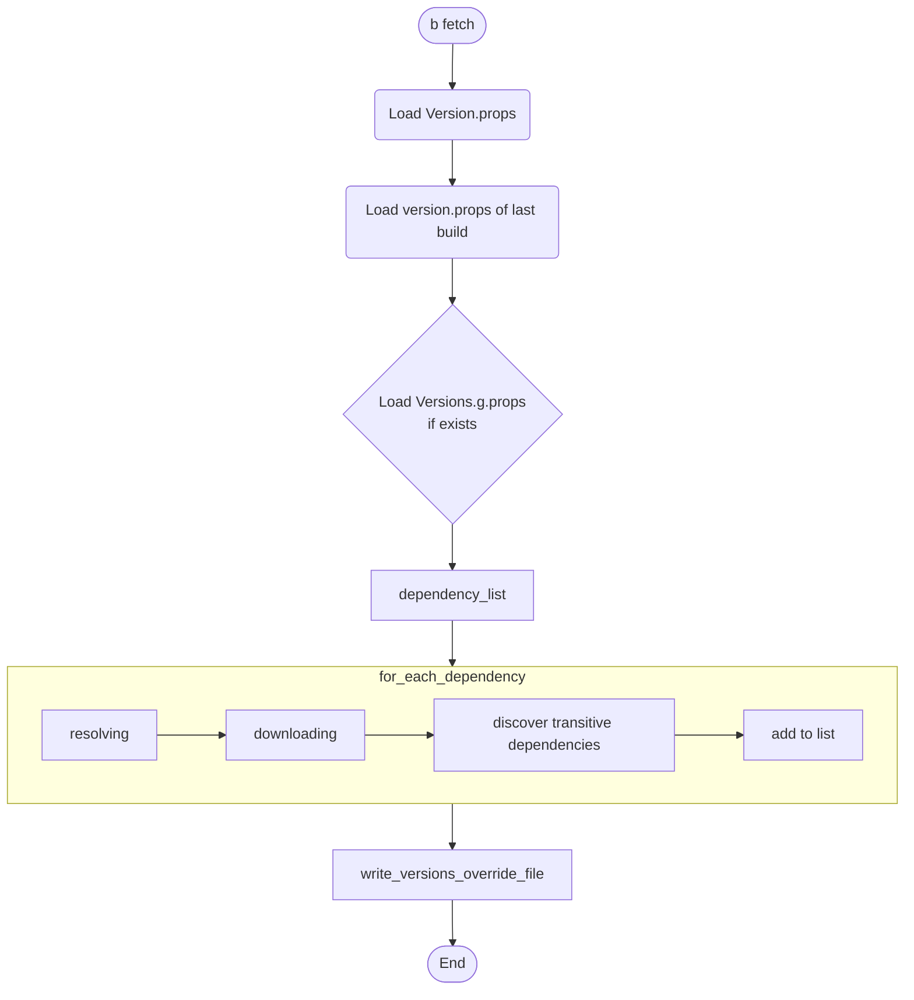
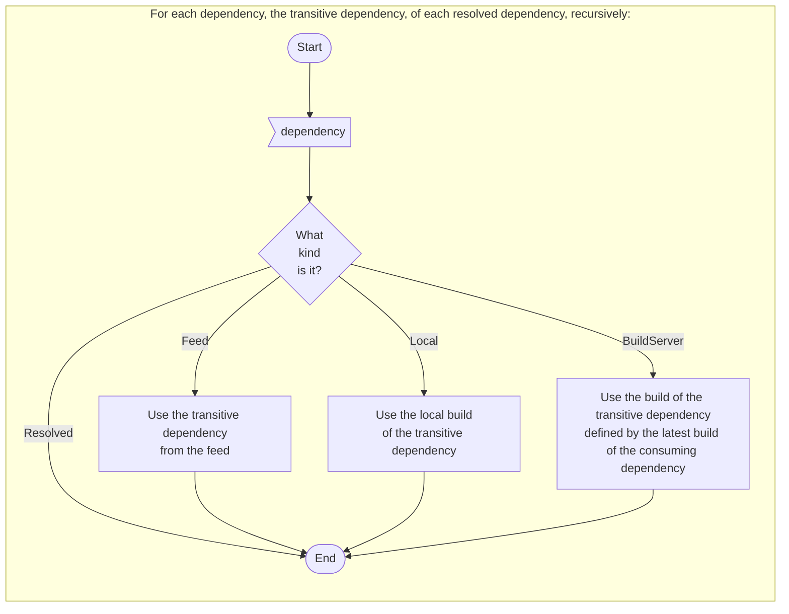

# Build flow

```mermaid
flowchart TB
    start([b prepare])

    start --> are_dependencies_resolved{Are<br>dependencies<br>resolved?}


    are_dependencies_resolved --> |Yes| END
    are_dependencies_resolved --> fetch[b fetch] --> END

    END([End])
```

```mermaid
flowchart TB
    start([b fetch])

    start --> load_default_version(Load Version.props)
    load_default_version --> load_last_build(Load version.props of last build)
     load_last_build --> load_versions_override_file{Load Versions.g.props<br/>if exists}
load_versions_override_file --> dependency_list
dependency_list --> for_each_dependency
subgraph for_each_dependency
    resolving --> downloading --> discover[discover transitive dependencies] --> add[add to list]
end


  for_each_dependency --> write_versions_override_file  --> END([End])
```

## Dependencies resolution

```mermaid
flowchart LR

    subgraph for_each_dependency[For each dependency, the transitive dependency, of each resolved dependency, recursively:]

        start([Start])

        start --> dependency>dependency]

        dependency --> switch_dependency_kind{What<br>kind<br>is it?}

switch_dependency_kind --> |Resolved| END
        switch_dependency_kind --> |Feed| use_feed[Use the transitive dependency<br>from the feed]
        switch_dependency_kind --> |Local| use_local[Use the local build<br>of the transitive dependency]
        switch_dependency_kind --> |BuildServer| use_proven_dependency[Use the build of the transitive dependency<br>defined by the latest build of the consuming dependency]

        END([End])

        use_feed --> END
        use_local --> END
        use_proven_dependency --> END
    end
```