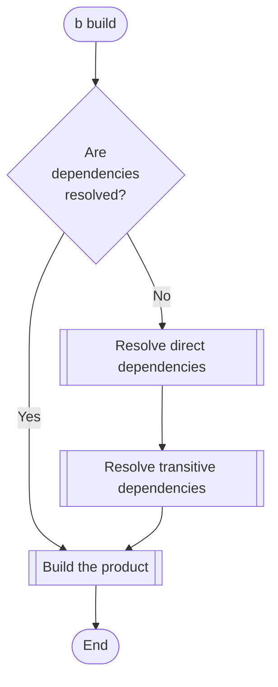
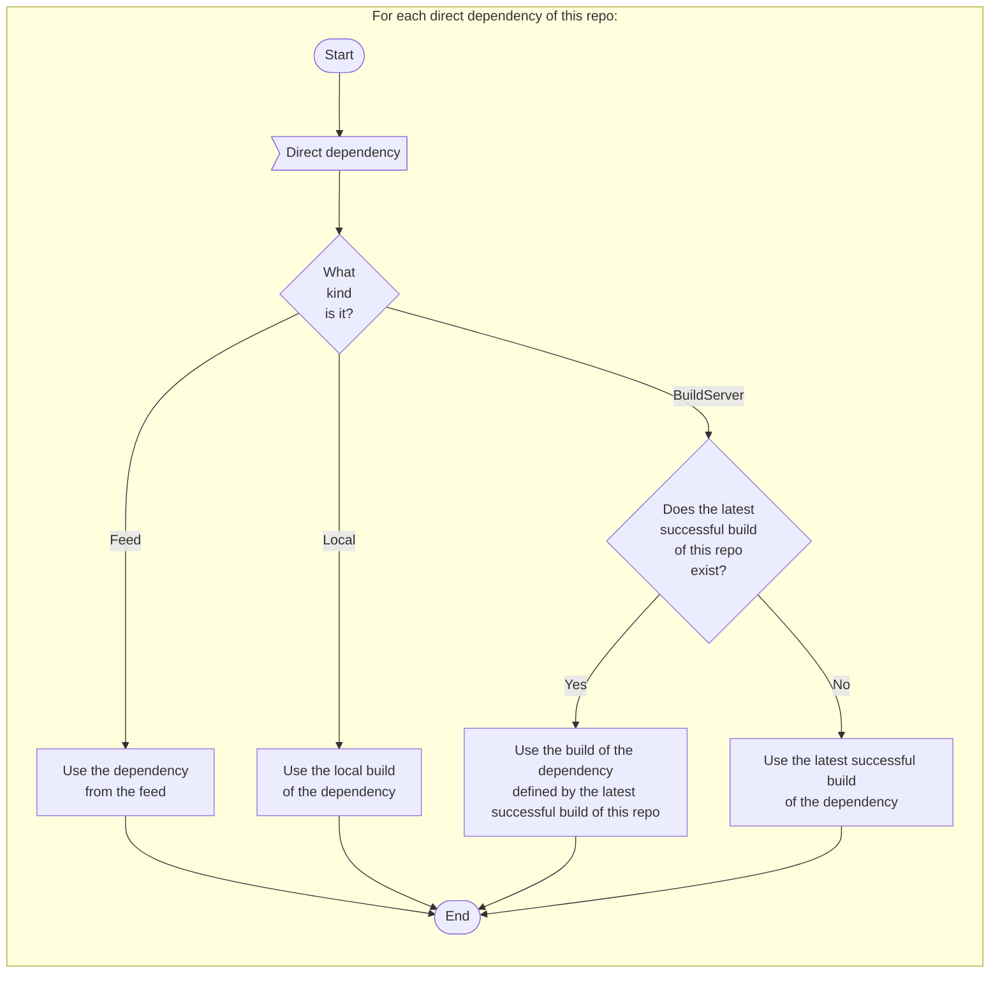
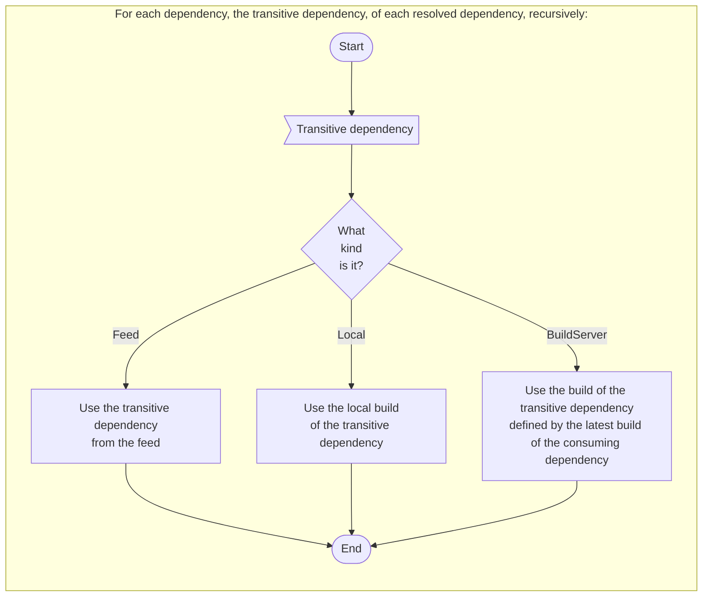

# Build flow

```mermaid
flowchart TB
    start([b build])

    start --> are_dependencies_resolved{Are<br>dependencies<br>resolved?}

    build[[Build the product]]

    resolve_direct_dependencies[[Resolve direct dependencies]]
    resolve_transitive_dependencies[[Resolve transitive dependencies]]

    are_dependencies_resolved --> |Yes| build
    are_dependencies_resolved --> |No| resolve_direct_dependencies --> resolve_transitive_dependencies --> build

    build --> END([End])
```

## Direct dependencies resolution

```mermaid
flowchart LR

    subgraph for_each_direct_dependency[For each direct dependency of this repo:]

        start([Start])

        start --> dependency>Direct dependency]

        dependency --> switch_dependency_kind{What<br>kind<br>is it?}

        switch_dependency_kind --> |Feed| use_feed[Use the dependency<br>from the feed]
        switch_dependency_kind --> |Local| use_local[Use the local build<br>of the dependency]
        switch_dependency_kind --> |BuildServer| latest_build_exists{Does the latest<br>successful build<br>of this repo<br>exist?}

        latest_build_exists --> |Yes| use_proven_dependency[Use the build of the dependency<br>defined by the latest successful build of this repo]
        latest_build_exists --> |No| use_latest_dependency[Use the latest successful build<br>of the dependency]

        END([End])

        use_feed --> END
        use_local --> END
        use_proven_dependency --> END
        use_latest_dependency --> END
    end
```

## Transitive dependencies resolution

```mermaid
flowchart LR

    subgraph for_each_dependency[For each dependency, the transitive dependency, of each resolved dependency, recursively:]

        start([Start])

        start --> dependency>Transitive dependency]

        dependency --> switch_dependency_kind{What<br>kind<br>is it?}

        switch_dependency_kind --> |Feed| use_feed[Use the transitive dependency<br>from the feed]
        switch_dependency_kind --> |Local| use_local[Use the local build<br>of the transitive dependency]
        switch_dependency_kind --> |BuildServer| use_proven_dependency[Use the build of the transitive dependency<br>defined by the latest build of the consuming dependency]

        END([End])

        use_feed --> END
        use_local --> END
        use_proven_dependency --> END
    end
```