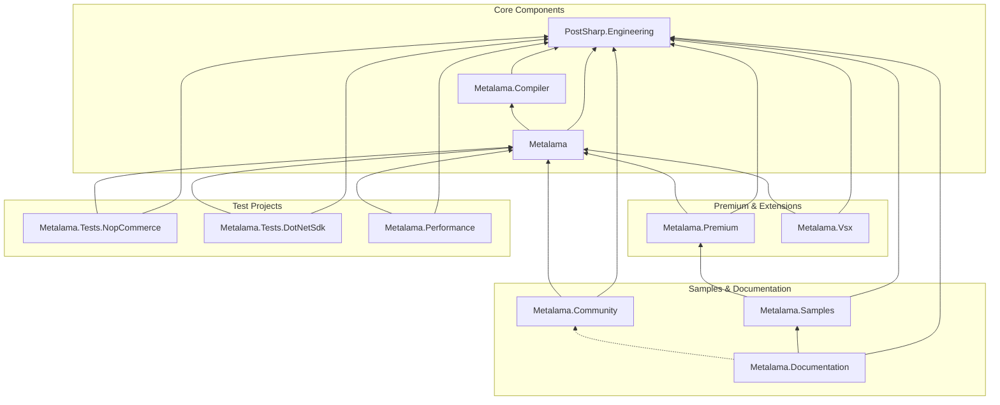

# Metalama Dependency Graph (2026.0)

This diagram shows the build dependencies between Metalama repositories. Arrows point from dependent to dependency (A → B means A depends on B).



## Dependency Sources

Dependencies can be resolved from three sources:

| Source | Description | Use Case |
|--------|-------------|----------|
| **Feed** | Published NuGet packages | Production builds, stable versions |
| **BuildServer** | TeamCity artifacts | CI/CD builds, latest compatible version |
| **Local** | Local repository clone | Local development, debugging |

## Managing Dependencies

```powershell
# List all dependencies
Build.ps1 dependencies list

# Use local build of a dependency
Build.ps1 dependencies set local Metalama

# Reset to default (feed/build server)
Build.ps1 dependencies reset --all

# Fetch latest from build server
Build.ps1 dependencies fetch

# Update to newest available version
Build.ps1 dependencies update
```