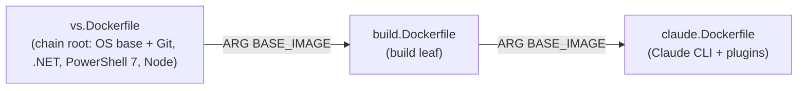

# DockerBuild.ps1

`DockerBuild.ps1` builds a Docker image from the repository's Dockerfile chain and then runs either
`Build.ps1` (the product build) or the Claude CLI **inside** a container, with the source tree and the
relevant host caches/sibling repositories mounted in.

> [!NOTE]
> `DockerBuild.ps1` is **generated**. The source of truth is
> `src/PostSharp.Engineering.BuildTools/Resources/DockerBuild.ps1`; regenerate the repo copy with
> `./Build.ps1 generate-scripts`. Never edit the generated `DockerBuild.ps1` by hand.

Requires **PowerShell 7.5+** (`pwsh`, not Windows PowerShell). Works with Windows containers (process or
Hyper-V isolation) and Linux containers (Docker Desktop / WSL2 backend).

## What it does

On each invocation the script:

1. **Resolves the image chain.** Dockerfiles declare their parent with `ARG BASE_IMAGE=<parent>.Dockerfile`.
   The resolver walks the chain, computes a content-hash tag per image, and builds/pulls each level
   parent-first.
2. **Collects environment variables and git identity** and writes them to a per-run `eng/.g/Init.g.ps1`,
   which is mounted (not baked) and executed at container start.
3. **Computes the mount set** — the source tree, the NuGet cache, source-dependencies, sibling product-family
   repos, and any `-Mount` directories.
4. **Builds a thin local "boot" image** over the resolved leaf that creates the bind-mount directories.
5. **Runs the container** (`docker run --rm`), executing `subst` (Windows), `Init.g.ps1`, then `Build.ps1`
   or `eng/RunClaude.ps1`.

### The image chain

Dockerfiles live in `eng/docker/` and are **prefix-free** — the file *stem* is the layer name, and the
product/version prefix lives only in the resolved image name:



- The default target is the **`build`** leaf; `-Claude` targets the **`claude`** leaf. The resolver builds
  the ancestors first.
- The image **name** is `<prefix>-<stem>` (e.g. `postsharpengineering-2023.2-build`); the **tag** is a
  content hash that folds the Dockerfile, its per-image context (`eng/docker-context/<stem>/`), the parent's
  hash, and an OS discriminator (`ltsc2022` vs `ltsc2025`). Identical inputs ⇒ identical tag ⇒ cache hit.
- Line endings are normalized before hashing, so a checkout with LF (dev) and one with CRLF (CI `autocrlf`)
  produce the **same** tag and share the registry cache.
- The **boot image** (`<leaf>-boot`) is a machine-specific layer that only creates the bind-mount
  directories. It is built locally and **never pushed**, keeping the shared chain images clean.

## Main flags

| Flag | Purpose |
|------|---------|
| `-Claude [prompt]` | Run the Claude CLI instead of `Build.ps1`. `-Claude` = interactive; `-Claude "prompt"` = non-interactive. |
| `-Interactive` | Open an interactive PowerShell session in the container (reuses a running container if one exists). |
| `-BuildImage` | Build the image chain only; do not run a container. |
| `-NoBuildImage` | Skip building; assume the image already exists (or will be pulled). |
| `-RegistryImage <ref>` | Use a pre-built image from a registry directly, skipping all Dockerfile logic. |
| `-Dockerfile <path>` | Use a custom Dockerfile instead of the `build`/`claude` leaf. |
| `-Clean` | Delete `bin`/`obj` on the host before building. |
| `-Update` | Force a full timestamp bump to invalidate the Docker cache (refreshes `@latest` Claude CLI / plugins). |
| `-Isolation process\|hyperv` | Container isolation. Windows only. Auto-detected when omitted: `process` on Windows Server, `hyperv` on Windows Desktop. |
| `-Memory <size>` / `-Cpus <n>\|dynamic` | Resource limits. Applied on Linux and macOS, and on Windows under Hyper-V isolation; Windows process isolation ignores them. `dynamic` rebalances CPUs under any isolation. |
| `-Mount <dir[:w]>` | Mount extra host directories (read-only by default, `:w` = writable; `*`/`**` globs supported). |
| `-Env NAME[=VALUE]` | Pass extra environment variables (host value or literal). |
| `-Ports <h:c>` | Publish container ports. |
| `-NoNuGetCache` | Do not mount the host NuGet cache. |
| `-PostInit <script>` | Run a script at the end of `Init.g.ps1` (fails the build if it returns non-zero). |
| `-NoMcp` | (Claude mode) Do not connect to the host MCP approval server. |
| `-StartVsmon` | Mount and enable the Visual Studio remote debugger. |
| `-Label <value>` | Tag the container `postsharp.build=<value>` for later cleanup. |

Run `Get-Help ./DockerBuild.ps1 -Full` for the complete list.

### Mounts and path mapping

The container sees host directories at the **same absolute paths** as on the host. This is deliberate: it
reproduces the CI directory layout so that `obj` files, `safe.directory` entries, and tool paths resolve
identically inside and outside the container. The default mount set is:

| Mounted | Mode | Why |
|---------|------|-----|
| The source tree (`$PSScriptRoot`) | writable | The repo being built. |
| Host NuGet cache | writable | Avoid re-downloading packages (`-NoNuGetCache` to skip). |
| `source-dependencies/*` and symlink targets | read-only | Local source dependencies. |
| Sibling `PostSharp*` / `Metalama*` repos (parent dir) | read-only | Cross-repo references in the product family. |
| `PostSharp.Engineering*` repos (grandparent dir) | read-only | The engineering SDK itself. |
| `PostSharp.Engineering` data dir | writable | Version counters, daily timestamp. |
| Anything from `-Mount` | per spec | Additional host dirs. |

#### Non-C: drive mapping via `subst` (Windows)

Windows containers expose only a `C:` drive. When a mount lives on another drive (e.g. a repo on `D:`), the
script mounts `D:\foo` to `C:\D\foo` in the container, then runs `subst D: C:\D` at container start so that
the original `D:\foo` path resolves correctly inside the container. Both the `C:\D\...` and `D:\...` forms
are registered as git `safe.directory` so git works regardless of how a path is presented.

This is what makes the **"same absolute path"** guarantee hold even for repos that are not on `C:`.

## Main scenarios

### 1. Normal local development — *no Docker*

Everyday local builds do **not** use `DockerBuild.ps1`. Developers run `Build.ps1` (or `dotnet build` /
`dotnet test`) directly on the host. `DockerBuild.ps1` exists for the situations below where an isolated,
CI-faithful, or sandboxed environment is needed.

### 2. Reproducing a CI build locally

```powershell
./DockerBuild.ps1 test
```

Builds the image chain and runs `Build.ps1 test` in the container. Because host directories are mapped to the
**exact same paths** inside the container (with `subst` covering non-`C:` drives), this reproduces what the
build agent sees — useful for diagnosing failures that only happen on CI.

### 3. Running Claude in a sandboxed container (typical dev/AI scenario)

```powershell
./DockerBuild.ps1 -Claude              # interactive
./DockerBuild.ps1 -Claude "Fix the failing tests"   # non-interactive
```

This is the common interactive scenario: Claude runs **with full permissions inside the container**, but the
container is the security boundary — it can only touch the mounted source tree and caches, not the rest of
the host. Claude-specific behavior:

- Runs `eng/RunClaude.ps1` rather than `Build.ps1`.
- The host `~/.claude/.sessions` and `~/.claude/projects` directories are mounted so history persists across
  container runs (plugins are baked into the image, not mounted).
- The `claude` image tag rotates once per UTC day (and on `-Update`) so `@latest` installs of the Claude CLI
  and marketplace plugins are refreshed.

#### Filtered host access: the MCP approval server

Inside the container Claude is sandboxed and has **no host credentials** — it cannot push, publish, or call
external services on its own. The deliberate escape hatch is the **MCP approval server**, a companion app in
this repository ([`src/PostSharp.Engineering.McpApprovalServer/`](../src/PostSharp.Engineering.McpApprovalServer/CLAUDE.md)).
It runs on the **host** as a WPF system-tray application and is the single, audited gateway through which
container-side Claude can request privileged host operations.

`DockerBuild.ps1` checks for it on `http://localhost:9847/health` before starting the container; start the
GUI app first (or pass `-NoMcp` to run with no host access at all). The container reaches it via the host
gateway IP, and the server is exposed through the `host-approval` MCP server as a single `ExecuteCommand`
tool.

When Claude calls `ExecuteCommand` (command + working directory + claimed purpose), the host server:

1. **Analyzes risk** with two analyzers in parallel — a fast regex rule engine (`CommandRules.cs`) and an AI
   analyzer (Claude CLI, Haiku escalating to Opus when uncertain) — and takes the **more restrictive** of the
   two. For `git push` it feeds the full commit diff to the AI to scan for secrets and inappropriate content.
2. **Asks the human for approval** via a GUI dialog showing the assessed risk. Critical operations (e.g.
   `nuget push`, force-push, repo delete) default to *reject*; previously approved identical commands in the
   same session can be auto-approved to avoid repeated prompts.
3. **Executes** the approved command via PowerShell **on the host** and returns the result to the container.

This is why everyday host operations from inside a Claude container — `git push`, `gh pr ...`, TeamCity API
calls, `dotnet nuget push` — go through `ExecuteCommand` rather than running directly. Local, in-container
work (builds, file edits, local git like commit/branch/diff) does **not** use the server. Security boundary:
the server binds to `localhost` only (never network-exposed), every command needs human approval, and host
**file** operations are forbidden — those must happen in the container.

### 4. CI scenario

On a build agent (`IS_TEAMCITY_AGENT` set):

- Git identity must come from `GIT_USER_NAME` / `GIT_USER_EMAIL` (the script errors if they are missing);
  secrets come from the host environment rather than the developer key vault.
- `process` isolation is selected automatically on Windows Server (faster, no per-container VM), so
  `-Memory` and `-Cpus` have no effect there. Linux agents always get both.
- The build agent path and LFS `system/git` parent repo are mounted when present.
- Dynamic CPU allocation (`-Cpus dynamic`) lets several agent containers share the host's cores and
  rebalances as containers start and exit.

#### Autonomous Claude on CI

A non-interactive Claude session (`-Claude "prompt"`) can also run **autonomously on a build agent** — for
example to triage a failure or open a fix PR as part of a pipeline. This differs from the interactive dev
scenario (§3) in two important ways:

- **No MCP server.** There is no human at the agent to approve requests, so the run uses `-NoMcp` and has
  **no privileged host gateway** at all. Anything the session does must be doable with the credentials handed
  to the container.
- **Limited "bot" identity, not the developer's rights.** Claude mode reads `CLAUDE_`-prefixed environment
  variables and passes them into the container **unprefixed** — e.g. `CLAUDE_GITHUB_TOKEN` becomes
  `GITHUB_TOKEN`, and `CLAUDE_GIT_USER_NAME` / `CLAUDE_GIT_USER_EMAIL` set the commit identity. The CI host
  populates these from a restricted bot identity, so the autonomous session acts with the **bot's** scoped
  tokens, never the rights of the authenticated user who configured the agent.

  On TeamCity, `CLAUDE_GITHUB_TOKEN` is a build-scoped GitHub App token like any other, but issued under a
  connection of its own. A build configuration issues exactly one token, so the agent's build configuration
  *replaces* the connection and the parameter it would otherwise inherit from its repository, by setting
  `AdditionalCiBuildConfiguration.GitHubAppToken`:

  ```csharp
  new PowershellAdditionalCiBuildConfiguration( "Claude", "Run Claude on Issue", ... )
  {
      GitHubAppToken = new GitHubAppTokenOverride( GitHubAppConnections.MetalamaAgent, "env.CLAUDE_GITHUB_TOKEN" )
  }
  ```

  The parameter name is what makes this work end to end: the token lands in `CLAUDE_GITHUB_TOKEN` on the
  agent, and the `CLAUDE_` forwarding above strips the prefix on the way into the container. The overriding
  app is deliberately weaker than the one the ordinary builds use — it can open pull requests and comment on
  issues, but holds no policy or ruleset bypass rights — so the agent cannot merge past the protections that
  the build system itself is trusted to bypass. The connection must serve the same GitHub organization as the
  repository; a token cannot reach across organizations.

The effect is a tightly bounded autonomous session: sandboxed by the container, scoped by the bot's tokens,
and with no human-approval escape hatch to the host.

### 5. Shared Docker registry on the LAN

Set `DOCKER_REGISTRY` (and optionally `DOCKER_USERNAME` / `DOCKER_PASSWORD`) to share the (expensive to
build) chain images between developer machines and the build-agent farm on the same LAN:

```powershell
$env:DOCKER_REGISTRY = 'docker-registry.lan'
./DockerBuild.ps1 -Claude
```

In registry mode the resolver, for each image in the chain:

1. uses the local image if its content-hash tag already exists, else
2. pulls it from the registry if the tag is present there, else
3. builds it locally and **queues an async push** back to the registry.

Pushes run in background jobs that start only after every host build finishes (so a push never overlaps a
build) and overlap the container run. Because the content-hash tag is independent of the registry prefix and
of host line endings, a tag built on one machine is a guaranteed cache hit on every other machine on the LAN
— the farm builds each layer once and everyone else pulls it.

## Generated companions

`DockerBuild.ps1` reads/writes several generated files (all under `eng/`, none committed):

| File | Role |
|------|------|
| `eng/docker/*.Dockerfile` | The image chain (generated from the `Docker/*Component` classes). |
| `eng/docker-context/<stem>/` | Per-image build context (the `.g/` subdir holds per-run files and is excluded from the hash). |
| `eng/.g/Init.g.ps1` | Per-run env vars + git config, mounted and executed at container start. |
| `eng/DockerMounts.g.ps1` | Optional extra mounts (generated by `Build.ps1 prepare` / `dependencies update`). |

## Customizing the container environment (product repos)

A product repo can adjust the environment variables passed to the container by committing an
**authored** (not generated) script at `eng/CustomizeDockerEnvironment.ps1`. If present,
`DockerBuild.ps1` dot-sources it after the variable set is assembled and **before**
`eng/.g/Init.g.ps1` is written, so the script can **add, change, or remove** variables.

The script receives the variable hashtable by reference plus context, via a `param()` block:

| Parameter | Meaning |
|-----------|---------|
| `$ContainerEnvironmentVariables` | The `[hashtable]` of variables to be injected (the full normal set). Mutate it in place. |
| `$DockerfileName` | The leaf Dockerfile file name without path (e.g. `build.Dockerfile` or `claude.Dockerfile`). Empty under `-RegistryImage`. |
| `$Claude` | `[switch]` — true when running the Claude leaf. |

```powershell
# eng/CustomizeDockerEnvironment.ps1
param(
    [hashtable] $ContainerEnvironmentVariables,
    [string]    $DockerfileName,
    [switch]    $Claude
)

if ($DockerfileName -eq 'claude.Dockerfile')
{
    $ContainerEnvironmentVariables.Remove('NUGET_PACKAGES')      # drop a variable
}
$ContainerEnvironmentVariables['PROGET_URL'] = 'https://proget.internal/…'   # add / change
```

Unlike the generated companions above, this file is **authored and committed** by the product
repo; the SDK never generates or overwrites it. It runs for both the build and Claude leaves,
but not under `-KeepInit` (which reuses an existing `Init.g.ps1` without re-collecting vars).

## Tests

The chained-image resolver has an integration suite at `tests/dockerbuild/` that drives the **real**
generated script against tiny fixture images. It needs a running Docker engine and is **not** part of
`dotnet test`. See [`tests/dockerbuild/README.md`](../tests/dockerbuild/README.md).
