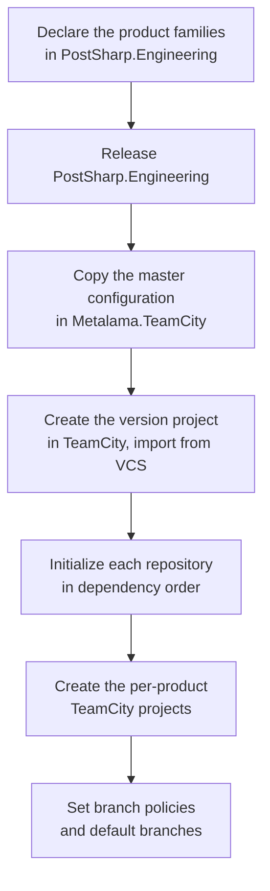

# Opening a product version line

A version line is a new `YYYY.N` of a product family: a set of long-lived branches across every
repository of the family, a TeamCity project tree that builds them, and a product family declared in
PostSharp.Engineering. This page opens one.

It was written while opening the Metalama 2027.0 line in August 2026, and every command, error
message and TeamCity response quoted below was observed during that run. The Metalama family is the
largest case — ten repositories in two GitHub organizations, plus a separate Metalama.Vsx family and
the PostSharp family below it — so the smaller families are a subset of what follows.

## Prerequisites

| Requirement | Why |
| --- | --- |
| TeamCity administrator rights on the `Metalama` project | Creating the version project and its subprojects. A developer account holds only run and view permissions, and project creation fails without elevation. |
| GitHub administrator rights on every repository of the family | `tools git set-branch-policies` and `set-default-branch` change branch protection and the default branch. `push` alone is not enough. |
| `TEAMCITY_CLOUD_TOKEN` in the environment | The variable `Build.ps1` itself reads. |
| PostSharp.Engineering 2023.2.413 or later | Earlier versions cannot create a TeamCity project at all — see [the CSRF defect](#teamcity-writes-need-2023-2-413-or-later). |

Grant the two administrator rights for the duration of the run and revoke them afterwards. Only the
TeamCity project creation and the branch policy steps need them.

## Order of work



The dependency order within step E matters, because each repository consumes the previous one through
TeamCity artifacts and cannot fetch its dependencies until the upstream build has produced them. For
Metalama that order is: Metalama.Compiler, Metalama, Metalama.Premium, Metalama.Community,
Metalama.Samples, Metalama.Documentation, Metalama.Tests.DotNetSdk, Metalama.Tests.NopCommerce,
Metalama.Consolidated, then Metalama.Vsx.

## 1. Declare the product families

Add one file per family under
`src/PostSharp.Engineering.BuildTools/Dependencies/Definitions/`, copying the newest existing family
of the same product. Branch names and TeamCity identifiers derive from `Family.Version`, so a copy
with the version changed needs no further editing.

Set `UpstreamProductFamily` to the family the new one merges from. PostSharp families never declare
one, because PostSharp has no upstream merge chain.

A new family must not reference a product that has no builds yet. Metalama.Vsx 2027.0 was written
against PostSharp 2027.0, whose build configuration does not exist and will not for a long time,
because PostSharp opens a version line only at release time. The reference had to be moved back to
PostSharp 2026.0, with a comment recording when it can move forward. Check every cross-family
reference this way before releasing.

## 2. Release PostSharp.Engineering

The product definitions are consumed as a package, so the families are inert until released. Follow
the deploy procedure in the repository's `CLAUDE.md`: commit, push, bump the version, then schedule
`Deploy [Public]`. Wait until the new version is indexed on nuget.org — the deploy finishes several
minutes before the package is resolvable.

## 3. Copy the master configuration

`Metalama.TeamCity` holds one directory per version line on `main`. Copy the newest to the new
version and change:

- `pom.xml` — the project identifier on all three lines (`name`, `groupId`, `artifactId`).
- `_Self/vcsRoots/*.kt` — the `branch` line and the six `branchSpec` entries in each file.
  Metalama.Tests.NopCommerce uses a `dev/` prefix where the others use `develop/`.

`settings.kts` and the subproject `Project.kt` files are copied unchanged.

Two things are worth knowing about this directory. The `2025.1` and `2026.0` directories were written
by TeamCity itself when versioned settings were switched on over projects that already existed — their
commit messages read `Synchronization with own VCS root is enabled (TeamCity change in ...)`. And a
star import of the VCS roots is in scope, so a subproject package that shares a name with a VCS root
is shadowed by it; see [the name collision](#a-subproject-package-is-shadowed-by-a-vcs-root).

## 4. Create the version project in TeamCity

Create the project under the family parent, then enable versioned settings on it with the same
configuration as the previous version: the `MetalamaTeamCity` VCS root, the new directory as the
settings path, Kotlin format, and settings taken from VCS.

**Enable it through the user interface, not through REST** — see
[settings attached through the API](#settings-attached-through-the-api-are-not-read-until-the-sync-is-toggled).
The interface asks which settings to use, and only "take the settings from VCS" imports the
directory. Choosing the other option is worse than doing nothing: a newly created project is empty,
so committing its current settings to VCS overwrites the directory just added.

When the import succeeds the project gains the VCS roots declared in `_Self/vcsRoots` and any
container subprojects, and nothing else.

## 5. Initialize each repository

Clone into a fresh per-version directory — `C:\src\Metalama-2027.0\<Repo>` — rather than reusing an
existing checkout. A local clone from the previous version's checkout is fast, after which the origin
is repointed at GitHub:

```powershell
git clone C:\src\Metalama-2026.1\<Repo> C:\src\Metalama-2027.0\<Repo> --branch develop/2026.1
git -C C:\src\Metalama-2027.0\<Repo> remote set-url origin <github-url>
git -C C:\src\Metalama-2027.0\<Repo> fetch origin
git -C C:\src\Metalama-2027.0\<Repo> branch --no-track develop/2027.0 origin/develop/2026.1
git -C C:\src\Metalama-2027.0\<Repo> branch --no-track release/2027.0 origin/develop/2026.1
```

Use `--no-track`. Without it the new branches track the *old* branch, and a bare `git push` writes to
the version line you are branching from.

Then, in this order:

1. `eng/MainVersion.props` — the new version, and `PackageVersionSuffix` set to `-preview`.
2. `eng/AutoUpdatedVersions.props` — every version of the family moved to the new version.
3. `./Build.ps1 dependencies update-eng` — must land on the release from step 2.
4. `eng/src/Program.cs` — the family alias moved to the new family.
5. `./Build.ps1 generate-scripts`.
6. Commit and push both branches with an explicit refspec.

Steps 3 and 4 are in that order for a reason; see [the family alias](#the-family-alias-is-changed-after-the-upgrade-not-before).

Steps 1 and 2 apply only to the product repositories. The test repositories are not versioned with
the family: Metalama.Tests.DotNetSdk stays at `1.0.0` and Metalama.Tests.NopCommerce keeps
nopCommerce's own `4.5.x`, exactly as they did when the previous line opened.

## 6. Create the per-product TeamCity projects

In each repository, with administrator rights held:

```powershell
./Build.ps1 teamcity project create-this
```

This creates the project under the version project, reuses the VCS root that the master configuration
already declared, and attaches versioned settings pointing at the repository's own `.teamcity`
directory.

**The build configurations do not appear yet.** Open each new project in the user interface, disable
its versioned settings and enable them again, taking the settings from VCS. Only then does TeamCity
read the repository and create the build configurations. This is the same defect as in step 4 and has
the same cause; see [settings attached through the API](#settings-attached-through-the-api-are-not-read-until-the-sync-is-toggled).

Check the result against the previous version line: each project should end with the same number of
build configurations as its counterpart. A project stuck at zero has not been toggled, or its script
failed to compile — the error is shown on its versioned settings page.

These projects cannot be declared in the master configuration instead. See
[the relative project hierarchy](#product-subprojects-cannot-live-in-the-master-configuration).

Not every repository of a family has a TeamCity project. Metalama.Tests.DotNetSdk runs on GitHub
Actions, so it is skipped.

## 7. Branch policies

In each repository, with GitHub administrator rights held:

```powershell
./Build.ps1 tools git set-branch-policies
./Build.ps1 tools git set-default-branch
```

## What went wrong, and what it means

### Settings attached through the API are not read until the sync is toggled

This is the single most expensive thing to not know, because nothing reports it. It applies to every
project whose versioned settings are attached other than by hand: the version project created in
step 4, and every product project created by `create-this` in step 6.

TeamCity records the last revision it applied for a project. A project whose settings feature was
added through the REST API has no such record, so the server declines to apply anything and says so
only in its log:

```
Cannot find the last committed revision of project: [...], skip updating settings to revision ...
Please commit current project settings into VCS first or disable / enable versioned settings to
reset the current state.
```

From the outside the project simply sits there with the right VCS root, the right settings path, a
correct feature configuration, and no build configurations. Comparing the feature against a working
project shows no difference at all, because there is none — the missing part is the revision record,
which is not exposed.

The remedy is the one the message gives: disable the versioned settings and enable them again in the
user interface, choosing to take the settings from VCS. Doing the same through REST does not work,
because the API has no prompt and therefore imports nothing.

Do this for every project as it is created, and verify by build-configuration count rather than by
reading the settings back.

### TeamCity writes need 2023.2.413 or later

Every write through the TeamCity client failed with:

```
403 Forbidden: failed CSRF check: authenticated POST request is made, but neither tc-csrf-token
parameter nor X-TC-CSRF-Token header are provided.
```

The client accepted cookies, so the reads a command performs before it writes left it holding a
TeamCity session cookie, and the server then required a CSRF token. Reads were unaffected, which made
it look like a permissions problem: the account had `create_sub_project`, and the identical payload
sent by hand with the same bearer token succeeded.

Fixed in 2023.2.413. With an earlier version, `create-this` cannot work at all. If a write fails,
read the trace with `--verbose` before drawing conclusions — the status code alone is misleading.

### Product subprojects cannot live in the master configuration

Declaring a product subproject in the version project's Kotlin DSL, with the `versionedSettings`
feature that hands it to its own repository, is rejected:

```
Versioned settings project feature cannot be used in relative project hierarchy
```

A project declared in a parent's DSL may not own a settings root. Since each product project's build
configurations are generated into its own repository by `generate-scripts`, they need their own root,
so they must be created outside the DSL — which is what `create-this` does. TeamCity's own
serialization agrees: the directories it wrote for earlier versions contain the VCS roots and the
container subprojects, and no product subprojects.

### A subproject package is shadowed by a VCS root

`_Self/Project.kt` opens with `import _Self.vcsRoots.*`. A subproject package whose name matches a
VCS root object is therefore shadowed, and `MetalamaCompiler.Project` resolves against the
`GitVcsRoot`:

```
_Self/Project.kt [19:33]: Unresolved reference: Project
```

Import the subproject under an alias. `MetalamaTests` is unaffected only because no VCS root carries
that name.

### The family alias is changed after the upgrade, not before

`dependencies update-eng` builds the product definition project in order to run, so a definition that
already names the new family cannot compile against the version being upgraded *from*:

```
error CS0426: The type name 'V2027_0' does not exist in the type 'MetalamaDependencies'
```

Upgrade first, change the alias second.

### The package version suffix needs its dash

`PackageVersionSuffix` is concatenated onto the main version with no separator, so `preview` yields
`2027.0.0preview` and restore fails with `'2027.0.0preview' is not a valid version string`. The
correct value is `-preview`. The commit that opened the 2026.1 line made this mistake and corrected
it nine minutes later; follow the correction.

### Every family version in AutoUpdatedVersions.props moves

The file holds the repository's own release version *and* the versions of the family products it
consumes. All of them move to the new version. Moving only the repository's own version leaves
consumers pinned to the previous line.

### Fresh clones avoid a bootstrap problem

`eng/Versions.*.g.props` are generated and ignored by git, and they pin the engineering version. In an
existing checkout the first upgrade across the 2023.2.412 boundary needs them deleted by hand. A
fresh clone has none, so the problem does not arise.

### Restore caches the old version silently

After pointing a repository at a different engineering build, the product definition may keep the
previous version because `project.assets.json` is already resolved. Delete `eng/src/obj` — the banner
line `Using PostSharp.Engineering v...` is the check that it worked.

## Related pages

- [dependencies.md](dependencies.md) — the dependency graph that fixes the order of step 5.
- [build-flow.md](build-flow.md) — what `Build.ps1` does at each step.
- [publish-flow.md](publish-flow.md) — the deploy procedure used in step 2.
