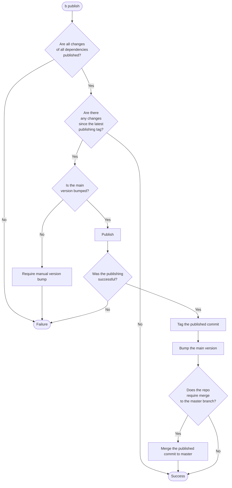
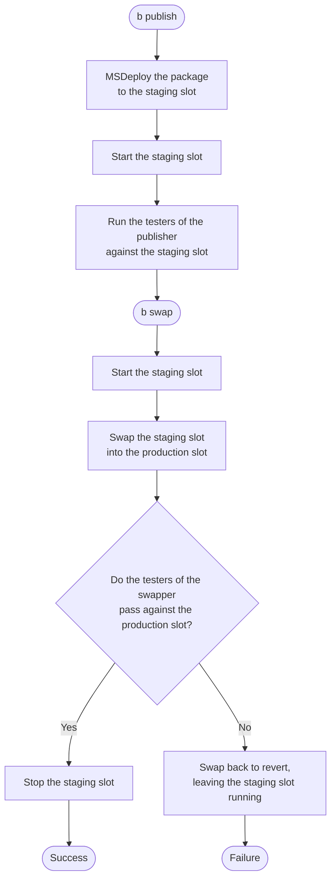
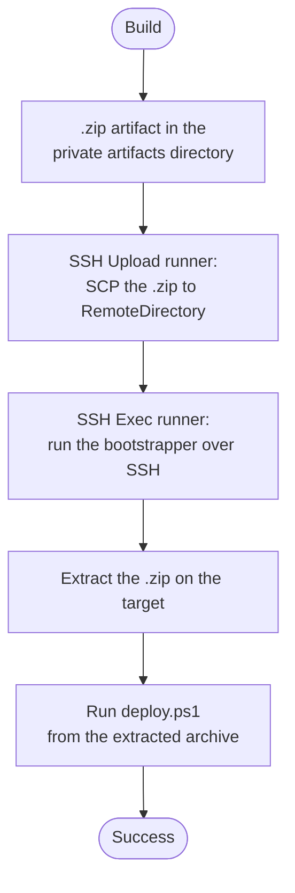

# Publishing flow

## Web sites

A web site is published by `MsDeployPublisher` to an Azure AppService deployment slot, then promoted to
production by `AppServiceSwapper`. The staging slot is stopped whenever no deployment is in progress: after a
swap it runs the application that was previously in production, which we do not want to keep running.

The swap runs either inline at the end of `b publish`, when `BuildConfigurationInfo.SwapAfterPublishing` is
set, or as a separate `b swap` step, which TeamCity exposes as its own build configuration. The staging slot
is started twice because these two steps can run hours apart.

Deploying to a stopped slot works because stopping a slot does not stop its SCM site, through which MSDeploy
works. Conversely, a slot must be running to be swapped: Azure restarts and warms up every instance of the
source slot and aborts the swap if any of them fails to answer an HTTP request. This is why the slot is
started before the swap and stopped only after it.

The staging slot is left running after a failed or reverted swap, so that the failed deployment can be
investigated and swapped back manually. It is stopped when the swap is skipped, which happens for a
pre-release when `Swapper.SwapPrerelease` is not set.

These properties opt out of the behavior:

| Property | Default | Effect when `false` |
|---|---|---|
| `MsDeployConfiguration.StartSlotAfterDeployment` | `true` | The slot is not started after the package has been deployed to it. |
| `AppServiceSwapper.StartSourceSlotBeforeSwap` | `true` | The source slot is not started before the swap. |
| `AppServiceSwapper.StopSourceSlotAfterSwap` | `true` | The source slot is left running after the swap. |

## Deploying to a machine over SSH

A build artifact can be deployed to an arbitrary machine over SSH. The deployment is declared like any other, as a
`Publisher` — one `SshPublisher` per target machine, placed in a build configuration's `PublicPublishers` or
`PrivatePublishers`. Unlike other publishers, though, `SshPublisher` is inert: it does no work during `b publish`.
Instead, when the TeamCity settings generator finds an `SshPublisher` among the publishers, it emits a dedicated
deployment configuration (`Deploy via SSH [<Configuration>]`) built from TeamCity's native SSH runners. So the
deployment is *modeled* as a publisher but *executed* by TeamCity, not by the `b publish` step. (A configuration whose
only publishers are `SshPublisher`s gets no publisher-based `Deploy` configuration — only the SSH one.)

For each target, the generated configuration runs two native build steps — an **SSH Upload (SCP)** runner and an
**SSH Exec** runner — and enables the **SSH Agent** build feature, which loads the uploaded private key so both runners
can authenticate.

The archive is pulled onto the deploy agent through an artifact dependency on the Build configuration, so any `.zip`
the build produces in the private artifacts directory is available to the SCP step. The default bootstrapper extracts
the most recently uploaded archive matching `ArchivePattern` into a `current` subdirectory of `RemoteDirectory` and
runs the `deploy.ps1` it contains.

The default is emitted as a `pwsh … -EncodedCommand <base64>` invocation (base64 of the UTF-16LE script)
**specifically so it survives a target whose default SSH shell is PowerShell** — the recommended setup. The SSH Exec
runner runs the command *through* that outer shell; a plain `pwsh -Command "…$var…"` would have its `$` variables
expanded by the outer pwsh before the inner script ran (`$ErrorActionPreference` → `Continue`, the path variables →
empty), breaking the deployment. A base64 payload contains no `$`, quotes, or spaces, so it passes through the outer
shell (pwsh, bash, or cmd) unchanged. (This is separate from, and additional to, the Kotlin `$` → `${'$'}` escaping,
which only makes `settings.kts` itself compile.)

A custom `BootstrapperCommand` is passed to the SSH Exec runner verbatim, so targets not running PowerShell are also
supported. But on a PowerShell-default-shell target, a custom `-Command "…$var…"` string is subject to the same
outer-shell expansion — encode it the same way (`pwsh … -EncodedCommand <base64>`) or otherwise keep it shell-safe.

The private key is provided by the TeamCity **SSH Agent** build feature, which loads a single uploaded key. All targets
in the same build configuration must therefore share the same `SshKeyName`.

### Configuration

| Property | Default | Effect |
|---|---|---|
| `SshPublisher.HostName` | (required) | Target host name or IP address. |
| `SshPublisher.UserName` | (required) | SSH user. |
| `SshPublisher.RemoteDirectory` | (required) | Directory the archive is uploaded to and extracted in. |
| `SshPublisher.Port` | `22` | SSH port. |
| `SshPublisher.SshKeyName` | `PostSharp.Engineering` | Name of the TeamCity-uploaded SSH key the SSH Agent feature loads. |
| `SshPublisher.ArchivePattern` | `*.zip` | File-name glob, in the private artifacts directory, of the archive to transfer. |
| `SshPublisher.BootstrapperCommand` | `null` | Remote command; when unset, the default `pwsh` extract-and-run one-liner is used. |

### Prerequisites

- An SSH key named per `SshKeyName` is uploaded to the TeamCity project (Project Settings &rarr; SSH Keys).
- The target machine runs an OpenSSH server, has `pwsh` on the `PATH`, and the deploy user's public key in
  `authorized_keys`.
- The target host key is trusted by the build agent (`known_hosts`), because the SSH runners verify host keys.