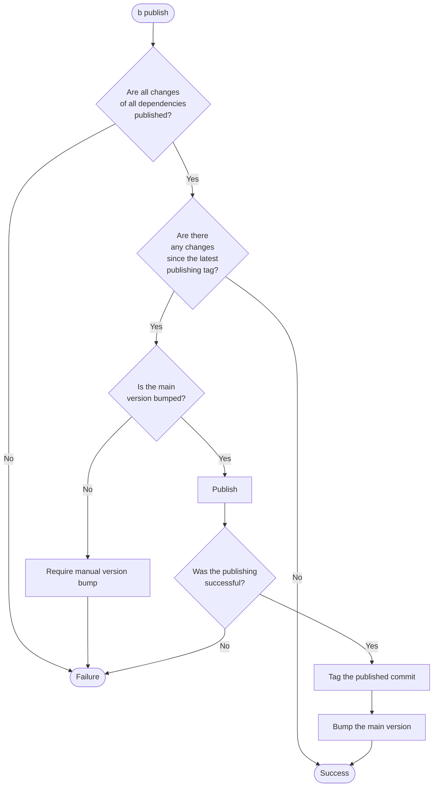

# Publishing flow

```mermaid
flowchart TB
    start([b publish])
    success([Success])
    failure([Failure])

    start --> dependencies_published{Are all changes<br>of all dependencies<br>published?}
    
    dependencies_published --> |Yes| any_changes{Are there<br>any changes<br>since the latest<br>publishing tag?}
    dependencies_published --> |No| failure

    any_changes --> |Yes| is_version_bumped{Is the main<br>version bumped?}
    any_changes --> |No| success

    is_version_bumped --> |Yes| publish[Publish]
    is_version_bumped --> |No| manual_version_bump[Require manual version bump] --> failure

    publish --> is_published{Was the publishing<br>successful?}

    is_published --> |Yes| tag[Tag the published commit] --> version_bump[Bump the main version] --> success
    is_published --> |No| failure
```